# 🚀 SwiftCare Admin Template

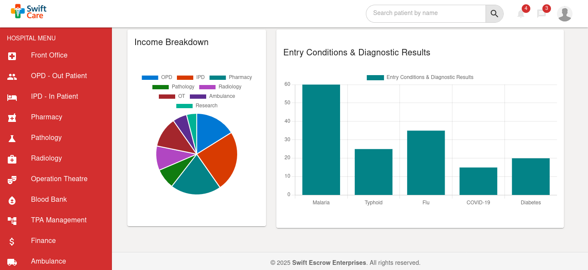

**SwiftCare Admin Template** is a powerful, modern, and fully customizable **React + Material UI** dashboard built for high-performance applications. Whether you're managing a **hospital**, **pharmacy**, **clinic**, **HR system**, or even a **CRM or POS**, SwiftCare gives you a professional and scalable foundation — for **free**.

---

## 📸 Preview Screenshots

| Login | OTP Verification | Lock Screen |
|-------|------------------|-------------|
|  | 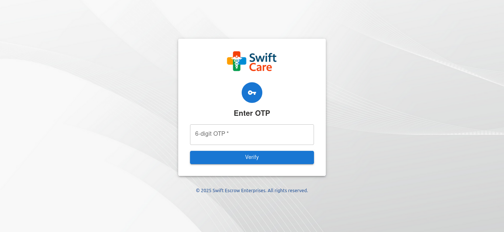 | 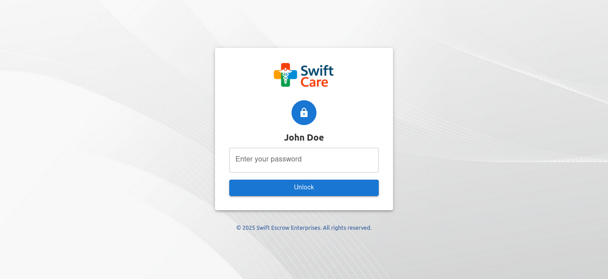 |

More sample views:

- 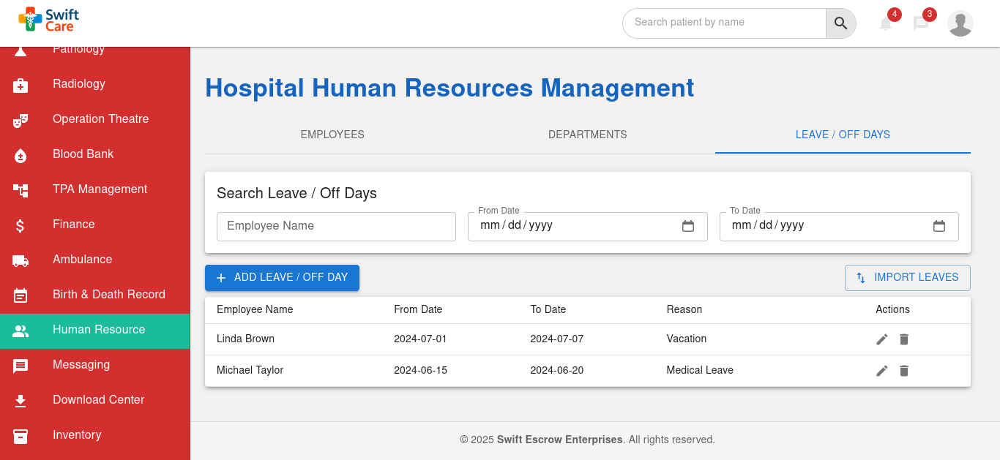
- 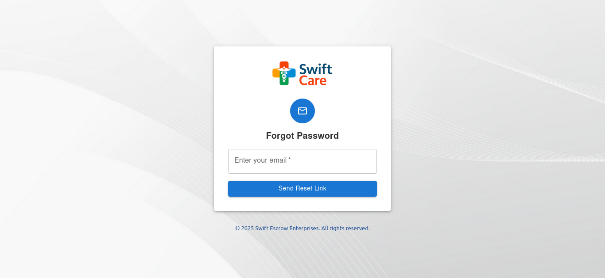
- 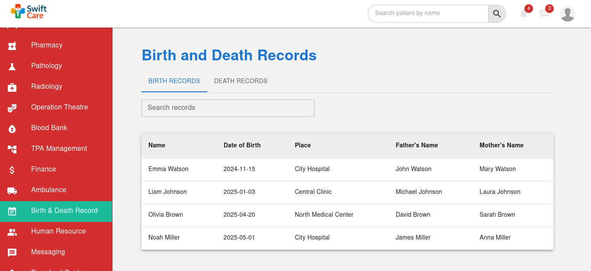
- 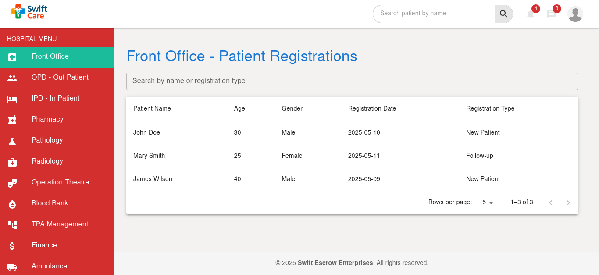
- 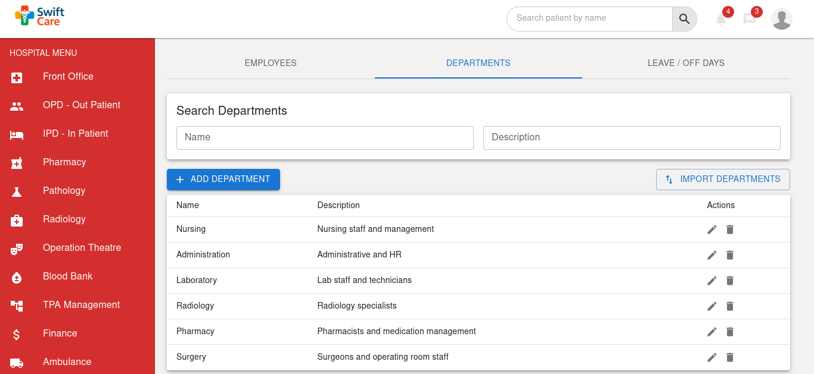
- 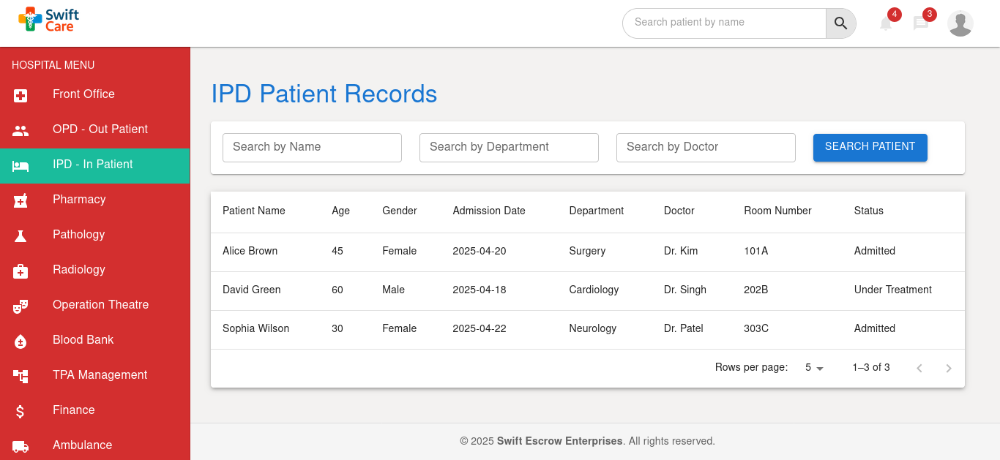
- 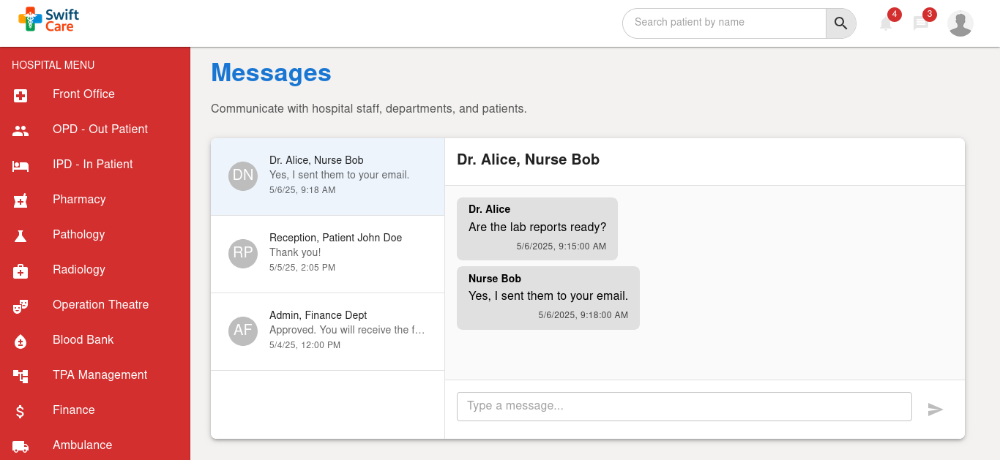
- 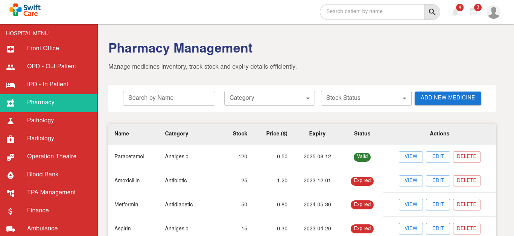

> More screenshots are located in the `screenshots/` directory.

---

## ✨ Features

- ⚛️ **Built with React 18 + MUI 5**
- 🧩 Modular Component Design
- 🔐 Auth pages: Login, OTP, Lock screen, Forgot password
- 📊 Beautifully designed dashboards with charts
- 👩‍⚕️ Hospital & Clinic Modules: IPD, OPD, Front Office, Birth & Death Records
- 🧑‍💼 HR & Payroll System: Leave, Payroll, Staff Directory
- 🛒 Pharmacy Management
- 💬 Internal Messaging System
- 🧠 Highly extensible structure
- 🌙 Light/Dark Mode
- 🌍 Responsive Layout

---

## 🧰 Tech Stack

- **React**
- **Material UI (MUI)**
- **React Router**
- **Context API**
- **Chart.js or Recharts (Customizable)**

---

## 🧑‍💻 Use Cases

You can use **SwiftCare Admin Template** for:

- 🏥 Hospital Management Systems (HMS)
- 🧑‍⚕️ Clinic Management Systems
- 💊 Pharmacy POS Systems
- 👥 HR Management Systems
- 💰 Payroll Systems
- 📞 CRM Platforms
- 🛍️ Sales & Inventory Dashboards
- 🧾 Finance/Accounts Panels
- 🗃️ Record Management Systems
- 📈 Analytics Dashboards
- 🧑‍🏫 School/Admin Portals
- 💼 General Admin Panels for Any Business

> 💡 With modular design and clean UI, it can be **repurposed for any domain** where a professional dashboard is needed.

---

## 📥 Getting Started

Clone and run locally:

```bash
# Clone the repo
git clone git@github.com:Stephenmasaku/swiftcare-admin-templat.git

# Navigate into project
cd swiftcare-admin-templat

# Install dependencies
npm install
# or
yarn install

# Start the development server
npm run dev
# or
yarn dev

